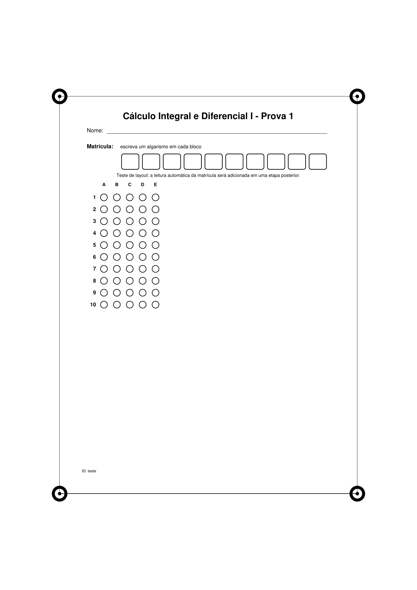

# Corretor OMR Local

Aplicação web local para criar avaliações objetivas, gerar folhas de respostas,
processar marcações com o **OMRChecker**, reconhecer matrículas escritas em
blocos com **Tesseract OCR** e registrar os resultados em **SQLite**.

> **Estado do projeto:** MVP em desenvolvimento. O processamento em lote por
> escrita manual é experimental e deve ser validado com folhas físicas antes de
> uso em uma turma completa.



## Recursos atuais

- criação de avaliações com 2 a 5 alternativas por questão;
- pesos uniformes ou peso por questão;
- geração de folha de respostas e solução;
- folha padrão com matrícula escrita em dez blocos;
- correção individual por aluno;
- envio em lote de imagens ou PDFs;
- separação de PDF com várias páginas;
- alinhamento da folha pelos quatro marcadores;
- OCR local da matrícula com Tesseract;
- correção das alternativas com OMRChecker;
- associação automática da nota ao aluno identificado;
- armazenamento local em JSON, arquivos e SQLite;
- visualização da folha original, processada e do resultado por questão.

## Arquitetura resumida

```text
Navegador
   │
   ▼
FastAPI + interface HTML/CSS/JavaScript
   │
   ├── Tesseract OCR ── matrícula escrita em blocos
   ├── OMRChecker ───── alternativas marcadas
   └── SQLAlchemy ───── SQLite local
                         + arquivos JSON/PDF/imagens
```

## Instalação rápida no macOS

Pré-requisitos: Git, Python 3.11 ou superior, Homebrew e Tesseract.

```bash
brew install tesseract
git clone <URL-DO-SEU-REPOSITORIO>
cd corretor-omr-local
bash scripts/setup_macos.sh
bash scripts/run_macos.sh
```

Abra:

```text
http://127.0.0.1:8003
```

Veja a instalação completa em [docs/INSTALACAO.md](docs/INSTALACAO.md).

## Estrutura

```text
corretor-omr-local/
├── avaliacao_web/        # aplicação FastAPI
├── docs/                 # documentação técnica e de uso
├── scripts/              # instalação, execução, backup e diagnóstico
├── tests/                # testes básicos sem processamento físico
├── external/             # OMRChecker clonado localmente; ignorado pelo Git
├── .github/              # CI e modelos de issue
├── .env.example
├── requirements.txt
└── README.md
```

## Dados e privacidade

Provas, matrículas, notas, banco SQLite e imagens ficam em
`avaliacao_web/data/`. Essa pasta está protegida pelo `.gitignore` e **não deve
ser enviada ao GitHub**. Leia [docs/PRIVACIDADE.md](docs/PRIVACIDADE.md).

## Comandos úteis

```bash
# Diagnóstico do ambiente
python scripts/check_environment.py
python scripts/check_repository.py

# Inicializar o banco
python -m avaliacao_web.database_cli init

# Importar JSON existente para o SQLite
python -m avaliacao_web.database_cli import-json

# Ver o estado do banco
python -m avaliacao_web.database_cli status

# Executar testes
pytest

# Criar backup local
bash scripts/backup_data.sh
```

## Documentação

- [Instalação](docs/INSTALACAO.md)
- [Guia de uso](docs/GUIA_DE_USO.md)
- [Arquitetura](docs/ARQUITETURA.md)
- [Banco de dados](docs/BANCO_DE_DADOS.md)
- [Processamento OMR e OCR](docs/PROCESSAMENTO_OMR_OCR.md)
- [Solução de problemas](docs/SOLUCAO_DE_PROBLEMAS.md)
- [Publicação no GitHub](docs/PUBLICAR_NO_GITHUB.md)
- [Roadmap](ROADMAP.md)

## Dependência externa

Este projeto integra o [OMRChecker](https://github.com/Udayraj123/OMRChecker),
que é clonado separadamente pelos scripts e não é incluído neste repositório.
Consulte [NOTICE.md](NOTICE.md).

## Licença

Nenhuma licença de distribuição foi escolhida ainda. Antes de tornar o
repositório público, consulte [docs/LICENCA.md](docs/LICENCA.md).
